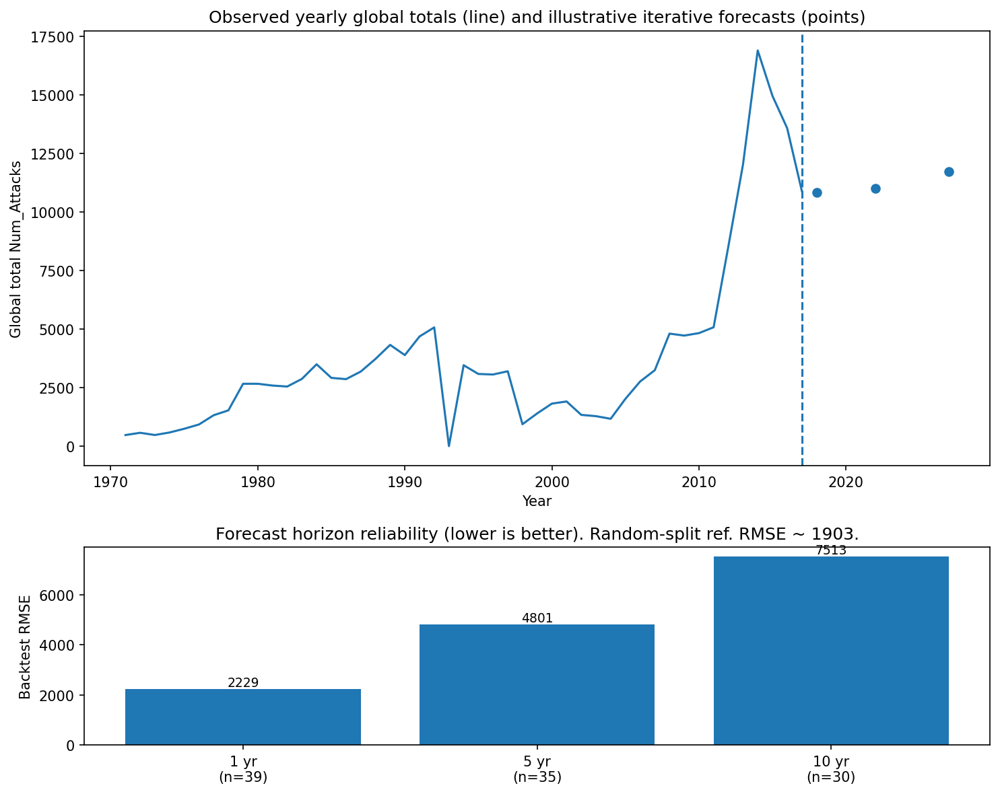

# Predictive regression: global attack totals (lag model)

**More advanced panel workflow (country–year, RF vs Ridge, direct horizons, risk, clustering):**  
see [`../panelModel/README.md`](../panelModel/README.md) and `panel_forecast_and_risk.py`.

---

`forecast_num_attacks.py` builds a **supervised** table from **global** yearly totals:  
`total_t = sum(Num_Attacks)` by calendar year, with **lag1** = previous year’s total. Missing years in the CSV are reindexed and filled with **0** (only **1993** is missing in the current file).

## Run

```bash
python analysis/predictive/regressionModel/forecast_num_attacks.py
```

That command refreshes artifacts under **`outputs/`**, prints the summary below, and writes **`outputs/forecast_visualization.png`**.

## Visual summary



**Top panel — time series**

- **Line:** observed **global** total attacks each year (1971–2017 in the supervised frame).
- **Dashed vertical line:** last year in the data (**2017**).
- **Points:** **illustrative** iterative forecasts for **2018**, **2022**, and **2027** (1, 5, and 10 steps ahead from 2017 using the fitted model). These are **not** validated future values—only a demo of how chained predictions behave.

**Bottom panel — bar chart**

- **Height:** **backtest RMSE** for each **forecast horizon** (1, 5, or 10 years), averaged over many **anchor years** (see `n=` on each bar). **Lower** bars mean **smaller typical error** when that horizon is evaluated on history.
- **Takeaway:** **1-year** forecasts are **most reliable** here; **5** and **10** years are **worse** because each step uses the **previous prediction** as the lag, so mistakes **compound**.

---

## Example console output (current `master_country_year.csv`)

```text
=== Global yearly totals: lag1 + year -> Ridge regression ===
Year span (supervised rows): 1971-2017 (n=47)

=== Backtest RMSE by iterative horizon (lower = more reliable here) ===
  h=1 year:  RMSE ~ 2228.81  (anchors used: 39)
  h=5 years: RMSE ~ 4801.24  (anchors used: 35)
  h=10 years: RMSE ~ 7512.51  (anchors used: 30)

Typical pattern: h=1 is smallest; error grows as horizon lengthens because each step feeds model output back as the lag (error compounding).

Random split reference RMSE (same features, not pure time CV): 1902.86

=== Illustrative forward iterations from last data year ===
Last observed year 2017, total attacks ~ 10,900
Iterated point forecast total attacks in 2018: 10,837.93
Iterated point forecast total attacks in 2022: 11,004.18
Iterated point forecast total attacks in 2027: 11,739.90
These extrapolations are not calibrated for true out-of-sample years; use only as demos.

Wrote .../outputs/horizon_backtest_rmse.csv
Wrote .../outputs/forward_iterative_forecasts.csv
Wrote .../outputs/forecast_visualization.png
```

*(Paths depend on your machine; filenames are as listed.)*

---

## What each part means

| Section | Meaning |
|--------|---------|
| **Year span (n=47)** | One row per calendar year from **1971** through **2017** after building `lag1` (1970 is only used as lag, not as a target row). |
| **Backtest RMSE (h=1, 5, 10)** | For each **anchor** year, the model is trained on all **prior** years, then run **forward** 1, 5, or 10 steps using **predicted** totals as lags. RMSE compares the **final** step to the **real** global total in that future year, then averages over anchors. |
| **Anchors used** | How many anchor years had enough history and a real future value for that horizon (fewer for **h=10** because the series ends at 2017). |
| **Random split reference RMSE** | **Train/test split** on rows **ignoring time order**—useful as a benchmark, but **not** a pure time-series validation. It can look **better** than some horizon metrics because it does not simulate **multi-step** chaining. |
| **Forward iterations from 2017** | Single **demo** path: train on all supervised rows, then predict 2018, use that as lag for 2019, … through 2022 and 2027. **Do not** treat these numbers as official forecasts. |

## Model (recap)

- **Features:** `lag1`, `year`  
- **Estimator:** `Pipeline(StandardScaler, RidgeCV)`  
- **Horizons:** **Iterative** multi-step forecasts (error compounding).

## Output files (under `outputs/`)

| File | Contents |
|------|----------|
| `horizon_backtest_rmse.csv` | RMSE and anchor counts per horizon |
| `forward_iterative_forecasts.csv` | Demo point forecasts for years 2018, 2022, 2027 |
| `forecast_visualization.png` | Figure described above |

## Scope note

This is **aggregate global** behavior, not **per-country** next-year panels. Extending to country-specific lags would need careful handling of **missing years** and **hierarchical** structure.
